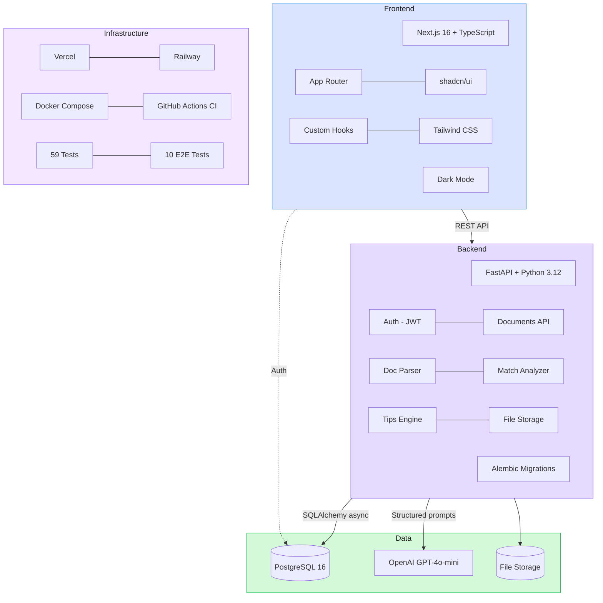
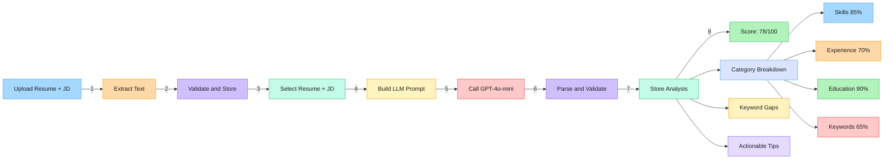

# DocuQuery

**AI-powered resume-job match analysis.** Upload your resume and a job description — get a match score, keyword gaps, category breakdown, and actionable tips to land the interview.

[](https://github.com/soneeee22000/DocuQuery-dev/actions/workflows/ci.yml)
[](backend/tests)
[](frontend/e2e)
[](frontend/tsconfig.json)
[](backend/pyproject.toml)
[](LICENSE)

**[Live Demo](https://docu-query-dev.vercel.app)** | **[Architecture](#architecture)** | **[API Reference](#api-reference)** | **[Getting Started](#getting-started)**

---

## The Problem

Job seekers waste hours manually comparing resumes to job descriptions. They miss keyword gaps, fail to tailor applications, and get filtered out by ATS systems — never knowing why.

## The Solution

DocuQuery gives you a **structured, AI-powered match analysis in under 30 seconds**:

- **Match Score (0-100)** — overall fit with weighted category breakdown
- **Category Analysis** — skills (35%), experience (30%), education (15%), keywords (20%)
- **Keyword Gap Detection** — exact terms missing from your resume
- **Actionable Tips** — prioritized suggestions referencing specific resume sections
- **Score Comparison** — re-upload a revised resume, see your improvement

---

## Architecture

### System Architecture



### Match Analysis Flow



> Interactive versions: [System Architecture](https://excalidraw.com/#json=BSZhDGDr5Qm3eDInxF8E8,EFSiUD4_xVdstYVDt2oipA) | [Analysis Flow](https://excalidraw.com/#json=Nuok9iHjYoT326RfiCf-B,9D9-jQvlv29quAIuccmsOw)

### Tech Stack

| Layer        | Technology                                               | Why                                                           |
| ------------ | -------------------------------------------------------- | ------------------------------------------------------------- |
| **Frontend** | Next.js 16, TypeScript (strict), Tailwind CSS, shadcn/ui | App Router, React 19, type safety, accessible components      |
| **Backend**  | FastAPI, Python 3.12, SQLAlchemy (async), Alembic        | Async-first, Pydantic validation, structured LLM output       |
| **Database** | PostgreSQL 16 (Supabase)                                 | JSONB for flexible analysis results, managed hosting          |
| **Auth**     | JWT (bcrypt + access/refresh tokens)                     | Stateless, horizontally scalable                              |
| **AI/LLM**   | OpenAI GPT-4o-mini                                       | JSON mode for structured output, cost-effective, configurable |
| **Testing**  | pytest (59), Playwright E2E (10), GitHub Actions CI      | Backend unit/integration + cross-browser E2E                  |
| **Deploy**   | Vercel (frontend) + Railway (backend)                    | Zero-config deploys, free tiers                               |
| **DevOps**   | Docker Compose, GitHub Actions                           | Local dev parity, automated lint/test/build                   |

### Key Design Decisions

| Decision                            | Rationale                                                                                       |
| ----------------------------------- | ----------------------------------------------------------------------------------------------- |
| **Structured JSON output from LLM** | GPT-4o-mini with `response_format=json_object` + Pydantic validation — no brittle regex parsing |
| **Async throughout**                | SQLAlchemy async sessions + FastAPI async routes — no blocking on DB or LLM calls               |
| **Service layer pattern**           | Route handlers are thin; business logic lives in `services/` — testable, swappable              |
| **Category-weighted scoring**       | Skills 35%, Experience 30%, Education 15%, Keywords 20% — reflects real hiring priorities       |
| **Dark mode via class strategy**    | `next-themes` with `useSyncExternalStore` — no hydration flash, respects system preference      |

---

## API Reference

All endpoints return a consistent response envelope:

```json
{ "data": {}, "error": null, "meta": {} }
```

| Method   | Endpoint                                  | Description                                  | Auth |
| -------- | ----------------------------------------- | -------------------------------------------- | ---- |
| `POST`   | `/api/v1/auth/register`                   | Create account                               | No   |
| `POST`   | `/api/v1/auth/login`                      | Get JWT tokens                               | No   |
| `POST`   | `/api/v1/auth/refresh`                    | Refresh access token                         | Yes  |
| `GET`    | `/api/v1/auth/me`                         | Get current user                             | Yes  |
| `POST`   | `/api/v1/documents/upload`                | Upload resume or JD (PDF/DOCX/TXT, max 10MB) | Yes  |
| `GET`    | `/api/v1/documents`                       | List user's documents                        | Yes  |
| `DELETE` | `/api/v1/documents/{id}`                  | Delete a document                            | Yes  |
| `POST`   | `/api/v1/analysis/match`                  | Trigger match analysis (resume_id + jd_id)   | Yes  |
| `GET`    | `/api/v1/analysis/{id}`                   | Get analysis result                          | Yes  |
| `GET`    | `/api/v1/analysis`                        | List past analyses                           | Yes  |
| `GET`    | `/api/v1/analysis/{id}/compare/{prev_id}` | Compare two analyses                         | Yes  |

---

## Getting Started

### Prerequisites

- Python 3.12+ and [uv](https://docs.astral.sh/uv/)
- Node.js 20+ and npm
- OpenAI API key
- PostgreSQL (via Docker or Supabase)

### Quick Start (Docker)

```bash
cp backend/.env.example backend/.env    # Fill in API keys
docker-compose up --build               # Starts DB + backend + frontend
```

App runs at `http://localhost:3000`, API at `http://localhost:8000`.

### Manual Setup

**Backend:**

```bash
cd backend
uv sync
cp .env.example .env                     # Fill in credentials
uv run alembic upgrade head              # Run migrations
uv run uvicorn app.main:app --reload     # http://localhost:8000
```

**Frontend:**

```bash
cd frontend
npm install
cp .env.example .env.local               # Set NEXT_PUBLIC_API_URL
npm run dev                              # http://localhost:3000
```

### Running Tests

```bash
# Backend (59 tests — models, routes, services, utils)
cd backend && uv run pytest tests/ -v

# Frontend lint + type check
cd frontend && npm run lint && npm run build

# E2E (10 Playwright tests — auth, documents, analysis, responsive)
cd frontend && npm run test:e2e
```

---

## Project Structure

```
docuquery/
├── backend/
│   ├── app/
│   │   ├── main.py                 # FastAPI app, CORS, exception handlers
│   │   ├── api/v1/                 # Route handlers (auth, documents, analysis)
│   │   ├── services/               # Business logic
│   │   │   ├── parser.py           #   PDF/DOCX/TXT text extraction
│   │   │   ├── analyzer.py         #   LLM-powered match analysis
│   │   │   ├── tips.py             #   Tip prioritization engine
│   │   │   ├── user_service.py     #   User CRUD
│   │   │   └── storage.py          #   File storage (swappable)
│   │   ├── models/                 # SQLAlchemy models (User, Document, Analysis)
│   │   ├── schemas/                # Pydantic request/response schemas
│   │   └── core/                   # Config, security, dependencies
│   ├── tests/                      # 59 tests mirroring app/ structure
│   └── alembic/                    # Database migrations
├── frontend/
│   ├── src/
│   │   ├── app/                    # Next.js App Router
│   │   │   ├── (auth)/             #   Login, register
│   │   │   └── (dashboard)/        #   Dashboard, documents, analysis, compare
│   │   ├── components/
│   │   │   ├── analysis/           #   ScoreGauge, CategoryCard, TipsList, deltas
│   │   │   ├── documents/          #   FileUpload, DocumentList, DeleteDialog
│   │   │   └── ui/                 #   shadcn/ui primitives, EmptyState
│   │   ├── hooks/                  #   useAuth, useDocuments, useAnalysis*, useDashboard
│   │   ├── lib/                    #   API client, auth, score-utils
│   │   └── types/                  #   TypeScript interfaces
│   ├── e2e/                        # 10 Playwright E2E tests
│   └── playwright.config.ts
├── docs/
│   ├── PRD.md                      # Product requirements (source of truth)
│   └── ARCHITECTURE.md             # System design, data models, flows
├── .github/workflows/ci.yml        # Lint + test + build on every push
├── docker-compose.yml
└── CHANGELOG.md
```

---

## Testing Strategy

| Layer                | Framework          | Count | What's Covered                                                                              |
| -------------------- | ------------------ | ----- | ------------------------------------------------------------------------------------------- |
| **Unit/Integration** | pytest + aiosqlite | 59    | Auth flows, document CRUD, analysis lifecycle, parser service, tips engine, file validation |
| **E2E**              | Playwright         | 10    | Register/login, upload/delete docs, trigger/view analysis, responsive sidebar, dark mode    |
| **CI**               | GitHub Actions     | --    | Lint (ruff + ESLint), format check, migrations, full test suite, production build           |

Tests use SQLite for fast isolation (not Postgres), OpenAI is mocked via `@patch`, and Playwright intercepts the analysis API with `page.route()` for deterministic results.

---

## Roadmap

| Version  | Features                                                           | Status  |
| -------- | ------------------------------------------------------------------ | ------- |
| **v1.0** | Match analysis, keyword gaps, tips, history, comparison, dark mode | Shipped |
| **v1.1** | Rate limiting, pagination, error boundaries, frontend unit tests   | Planned |
| **v2.0** | In-app resume editor — apply AI tips directly, then re-analyze     | Planned |

---

## Documentation

- **[Product Requirements (PRD)](docs/PRD.md)** — User stories, acceptance criteria, edge cases
- **[Architecture](docs/ARCHITECTURE.md)** — System design, data models, data flows, technical decisions
- **[Changelog](CHANGELOG.md)** — Release history

---

## License

MIT
