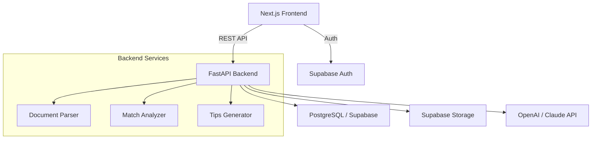

# PRD: DocuQuery

> **Status:** Phase 3 Complete
> **Author:** Pyae Sone (Seon)
> **Date:** 2026-03-04
> **Last Updated:** 2026-03-05

---

## 1. Problem Statement

### What problem are we solving?

Job seekers waste hours manually comparing their resumes against job descriptions, missing critical keyword gaps and failing to tailor their applications effectively. They lack actionable, structured feedback on how well their resume matches a specific role — leading to lower callback rates and wasted applications.

### Who has this problem?

Job seekers actively applying to roles — from new graduates tailoring their first resumes to experienced professionals pivoting careers. They need fast, AI-powered analysis that shows exactly what's missing and how to improve.

### Why now?

ATS (Applicant Tracking Systems) are increasingly keyword-driven. AI can now parse and compare documents semantically — not just keyword matching — to give genuinely useful match analysis. This is a high-value, high-frequency pain point with a clear monetization path.

---

## 2. Success Criteria

### Primary Metric

Users can upload a resume + job description and receive a detailed match analysis with actionable tips in under 30 seconds.

### Secondary Metrics

- [ ] API response time < 5s for match analysis (LLM latency included)
- [ ] Zero critical bugs in first 2 weeks
- [ ] 80%+ test coverage on critical paths (backend services, API endpoints)
- [ ] Match analysis includes at least: score, keyword gaps, section-by-section feedback, and 5+ actionable tips

### What does "done" look like?

A job seeker uploads their resume and a job description. They instantly see a match score, a breakdown of strengths/gaps by category (skills, experience, education, keywords), and specific tips to improve their resume for that role. They can iterate by uploading revised versions and re-analyzing.

---

## 3. User Stories & Acceptance Criteria

### Story 1: Upload Resume & Job Description for Match Analysis

**As a** job seeker, **I want to** upload my resume and paste/upload a job description, **so that** I can see how well my resume matches the role and what to improve.

**Acceptance Criteria:**

- [x] Given a PDF/DOCX resume and a job description (text or file), when I click "Analyze Match", then I receive a structured analysis within 30 seconds
- [x] Given the analysis is complete, when I view results, then I see: overall match score (0-100), keyword gap analysis, section-by-section feedback (skills, experience, education), and 5+ actionable improvement tips
- [x] Error state: when file format is unsupported or file is >10MB, then show a clear error message before upload

### Story 2: View Match Analysis Dashboard

**As a** job seeker, **I want to** see my match analysis in a clear, visual dashboard, **so that** I can quickly understand my strengths and gaps.

**Acceptance Criteria:**

- [x] Given an analysis is complete, when I view the dashboard, then I see: a match score gauge, categorized strengths (green) and gaps (red), missing keywords highlighted, and a prioritized tips list
- [x] Given multiple analyses exist, when I navigate to history, then I see past analyses sorted by date with resume name and job title
- [x] Error state: when the LLM fails to generate analysis, then show a retry button with a user-friendly message

### Story 3: Manage Documents

**As a** job seeker, **I want to** manage my uploaded resumes and job descriptions, **so that** I can keep my workspace organized.

**Acceptance Criteria:**

- [x] Given I have uploaded documents, when I view the documents page, then I see a list with file name, type (resume/JD), upload date, and delete action
- [x] Given I want to re-analyze, when I select an existing resume + a new JD, then I can trigger a new analysis without re-uploading
- [x] Error state: when deletion fails, then show an error toast and keep the document in the list

### Story 4: Authentication & User Sessions

**As a** job seeker, **I want to** create an account and log in, **so that** my analyses and documents are saved across sessions.

**Acceptance Criteria:**

- [x] Given I am a new user, when I register with email + password, then my account is created and I am logged in
- [x] Given I am a returning user, when I log in, then I see my previous analyses and documents
- [x] Error state: when credentials are invalid, then show a specific error (wrong password vs. account not found)

### Story 5: Iterate on Analysis

**As a** job seeker, **I want to** re-run the analysis after making resume changes, **so that** I can see if my score improved.

**Acceptance Criteria:**

- [x] Given I have a previous analysis, when I upload a revised resume against the same JD, then I see a new analysis with a comparison to the previous score
- [x] Given I want to compare, when I view the comparison, then I see which gaps were addressed and which remain
- [ ] Error state: when the same file is uploaded twice, then warn the user and allow them to proceed or cancel (deferred to v2)

---

## 4. Technical Architecture

### Stack Decision

| Layer    | Choice                                | Why                                                     |
| -------- | ------------------------------------- | ------------------------------------------------------- |
| Frontend | Next.js 15 + TypeScript + Tailwind    | SSR for SEO, App Router, matches stack preferences      |
| Backend  | FastAPI + Python 3.12                 | Async-first, Pydantic validation, fast for AI workloads |
| Database | PostgreSQL 16 (Supabase)              | JSONB for analysis results, robust, free tier available |
| AI/LLM   | OpenAI GPT-4o-mini (or Claude)        | Cost-effective, high quality for structured analysis    |
| Auth     | Supabase Auth (JWT)                   | Built-in with DB, social login ready                    |
| Storage  | Supabase Storage                      | Integrated with auth, file management                   |
| Hosting  | Vercel (frontend) + Railway (backend) | Free tiers, easy deploy                                 |
| CI/CD    | GitHub Actions                        | Lint + test + build on every PR                         |

### Architecture Diagram



### API Design (Key Endpoints)

| Method | Endpoint                                  | Purpose                                    | Auth Required |
| ------ | ----------------------------------------- | ------------------------------------------ | ------------- |
| POST   | `/api/v1/auth/register`                   | Register new user                          | No            |
| POST   | `/api/v1/auth/login`                      | Login, return JWT                          | No            |
| POST   | `/api/v1/documents/upload`                | Upload resume or JD (PDF/DOCX/TXT)         | Yes           |
| GET    | `/api/v1/documents`                       | List user's documents                      | Yes           |
| DELETE | `/api/v1/documents/{id}`                  | Delete a document                          | Yes           |
| POST   | `/api/v1/analysis/match`                  | Trigger match analysis (resume_id + jd_id) | Yes           |
| GET    | `/api/v1/analysis/{id}`                   | Get analysis result                        | Yes           |
| GET    | `/api/v1/analysis`                        | List user's past analyses                  | Yes           |
| GET    | `/api/v1/analysis/{id}/compare/{prev_id}` | Compare two analyses                       | Yes           |

### Data Model (Key Entities)

```
User (Supabase Auth)
  ├── Document (id, user_id, name, type[resume|jd], file_url, extracted_text, created_at)
  ├── Analysis (id, user_id, resume_id, jd_id, score, results_json, tips, created_at)
  └── AnalysisComparison (derived — computed on read, not stored)
```

**Analysis `results_json` structure:**

```json
{
  "overall_score": 78,
  "categories": {
    "skills": {
      "score": 85,
      "matched": ["Python", "React"],
      "missing": ["Kubernetes", "AWS"]
    },
    "experience": {
      "score": 70,
      "feedback": "3/5 years required. Highlight relevant projects."
    },
    "education": {
      "score": 90,
      "feedback": "Master's degree exceeds requirement."
    },
    "keywords": {
      "score": 65,
      "matched": 12,
      "total": 18,
      "missing": ["CI/CD", "Agile"]
    }
  },
  "tips": [
    {
      "priority": 1,
      "category": "skills",
      "tip": "Add Kubernetes experience from your side projects"
    },
    {
      "priority": 2,
      "category": "keywords",
      "tip": "Include 'CI/CD' in your DevOps section"
    }
  ]
}
```

### Third-Party Dependencies

| Dependency            | Purpose                      | Risk Level | Alternative           |
| --------------------- | ---------------------------- | ---------- | --------------------- |
| OpenAI API            | LLM for analysis + tips      | Medium     | Claude API, local LLM |
| Supabase              | Auth + DB + Storage          | Low        | Self-hosted Postgres  |
| PyMuPDF (fitz)        | PDF text extraction          | Low        | pdfplumber            |
| python-docx           | DOCX text extraction         | Low        | None needed           |
| sentence-transformers | Text embeddings (future RAG) | Low        | OpenAI embeddings     |

---

## 5. Edge Cases & Error Handling

### What can go wrong?

| Scenario                       | Expected Behavior                                                    | Priority |
| ------------------------------ | -------------------------------------------------------------------- | -------- |
| LLM API timeout (>30s)         | Return partial result if available, else retry once, then show error | P0       |
| Invalid file format uploaded   | Client-side validation + server reject with clear message            | P0       |
| File too large (>10MB)         | Client-side check before upload, server rejects with 413             | P0       |
| Resume has no extractable text | Detect empty extraction, return error "Could not read file"          | P1       |
| JD is too short (<50 words)    | Warn user, allow analysis but note low confidence                    | P1       |
| LLM returns malformed JSON     | Parse with fallback, retry once, then return generic analysis        | P1       |
| Duplicate file upload          | Warn user, allow if they confirm, skip re-extraction if identical    | P2       |
| Rate limit exceeded (LLM API)  | Queue request, show "Processing..." with ETA                         | P1       |
| Database connection lost       | Return 503, frontend shows "Service temporarily unavailable"         | P0       |
| Auth token expired             | Silent refresh via Supabase, redirect to login if fails              | P0       |

### Security Considerations

- [x] Input validation on all endpoints (Pydantic models)
- [x] SQL injection prevention (SQLAlchemy parameterized queries)
- [x] XSS prevention (sanitize all user-rendered content in Next.js)
- [x] CORS configured (specific origins, no wildcards in production)
- [ ] Rate limiting on auth + analysis endpoints (deferred to deployment)
- [x] Secrets in environment variables only (.env + .gitignore)
- [x] File type validation (magic bytes, not just extension)
- [ ] Max file size enforced at nginx/proxy level (deferred to deployment)

---

## 6. Testing Strategy

### Unit Tests (Target: 80%+ coverage on business logic)

- [x] Document parser (PDF, DOCX, TXT extraction)
- [x] Match analysis prompt builder
- [x] Analysis result parser (LLM JSON → structured output)
- [x] Score calculation logic
- [x] Tips prioritization logic
- [x] Input validation (file type, size, text length)

### Integration Tests

- [x] All API endpoints (happy path + error cases)
- [x] Database operations (CRUD for documents, analyses)
- [x] Authentication flow (register, login, refresh, logout)
- [x] LLM integration (mocked responses for deterministic tests)
- [x] File upload → extraction → storage pipeline

**Backend:** 59 tests passing (pytest, SQLite + aiosqlite)

### E2E Tests (Critical Paths Only)

- [x] Upload resume + JD → view match analysis (core flow)
- [x] Register → login → upload → analyze → view results
- [x] Re-upload revised resume → compare analyses

**Frontend E2E:** 10 Playwright tests across 4 spec files (auth, documents, analysis, responsive/theme). Desktop Chrome + iPhone 14 projects.

### What NOT to test

- Supabase Auth internals (tested by Supabase)
- LLM output quality (non-deterministic; test structure only)
- CSS/visual styling (manual review)

---

## 7. Milestones & Build Order

### Phase 1: Foundation (Day 1-3) ✅

- [x] Project scaffolding: FastAPI backend + Next.js frontend
- [x] Database schema + migrations (Supabase / SQLAlchemy)
- [x] Authentication system (Supabase Auth + JWT middleware)
- [x] File upload endpoint + Supabase Storage integration
- [x] Document extraction service (PDF, DOCX, TXT)
- [ ] CI pipeline (lint + test + build) — deferred to deployment
- **Gate:** Auth works, file upload + extraction works, CI green, all tests pass

### Phase 2: Core Feature — Match Analysis (Day 4-7) ✅

- [x] Match analysis service (prompt engineering + LLM call)
- [x] Analysis API endpoints (trigger, get result, list history)
- [x] Analysis result parser and scorer
- [x] Tips generator with priority ranking
- [x] Frontend: Upload page (resume + JD upload)
- [x] Frontend: Analysis dashboard (score, categories, tips)
- [x] Frontend: Analysis history page
- **Gate:** Core user story works end-to-end with tests. Upload → analyze → view results.

### Phase 3: Polish, Iterate & Ship (Day 8-12) ✅

- [x] Analysis comparison (checkbox select on history → score delta banner + category delta grid)
- [x] Document management page (list with skeletons, delete with toast, re-use for analysis)
- [x] Error handling: toast notifications (sonner), retry buttons, breadcrumbs, empty states
- [x] Loading states, empty states, skeleton screens (EmptyState component, Skeleton rows)
- [x] Responsive design (mobile sidebar with hamburger toggle) + dark mode (next-themes)
- [x] E2E tests on critical paths (Playwright — 10 tests: auth, documents, analysis, responsive)
- [x] Docker Compose for local dev (migration step added: `alembic upgrade head` before uvicorn)
- [ ] Documentation (README, API docs, .env.example) — to finalize
- **Gate:** All acceptance criteria met, 59 backend tests green, 10 E2E tests, zero P0 bugs, deployable

---

## 8. Out of Scope (Explicitly)

- NOT building: Real-time collaborative editing
- NOT building: Payment / subscription system
- NOT building: Social features (sharing analyses with others)
- NOT building: Job board integration or job search
- NOT building: ATS submission (we analyze, not submit)
- NOT building: Mobile app (responsive web only)
- **Will revisit in v2: In-app resume editor** — users can apply AI tips and edit their resume directly within DocuQuery, then re-analyze to see improvement. Architecture should account for this (extracted text stored, analysis results reference specific resume sections).

---

## 9. Open Questions

- [ ] Which LLM to use? OpenAI GPT-4o-mini (cheaper, fast) vs Claude (better structured output)? Can make this configurable.
- [ ] Should we support LinkedIn profile import as an alternative to resume upload? (Leaning: v2 feature)
- [ ] Do we need user-customizable analysis categories (e.g., weight skills higher)? (Leaning: v2, keep it simple for now)

---

## 10. Approval

- [ ] **PRD reviewed and understood** — I (Seon) confirm the requirements are clear
- [ ] **Architecture approved** — The technical approach makes sense
- [ ] **Scope locked** — No features will be added during build without updating this PRD

> **Once approved, this PRD becomes the source of truth. Every feature, every endpoint, every component traces back to a user story above. If it's not in the PRD, it's not getting built.**
